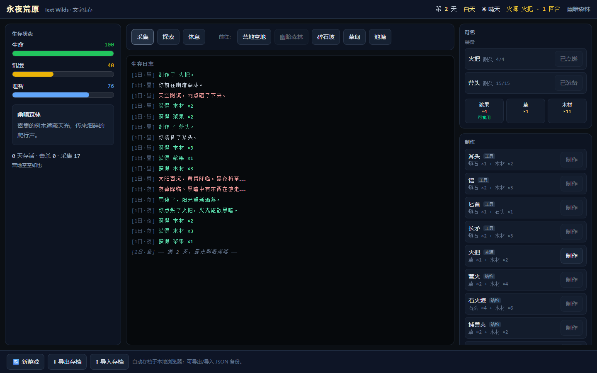

# 永夜荒原 Text Wilds

**文字版饥荒生存游戏（Don't Starve 风格 · Web 交互版）**

一座永夜荒原上，你从篝火余烬旁醒来。采集、制作、迁徙、点燃火把、与猎犬搏斗——在理智与饥饿的夹缝中活下去。

▶ 在线试玩：`https://text-survival-pi.vercel.app`

---

## 玩法

| 阶段 | 操作 |
| --- | --- |
| 白天 | 前往森林/碎石坡/草甸/池塘 **采集** 资源，或 **探索** 触发事件 |
| 黄昏 | 决定去向，准备夜晚的 **火源**（火把/营火） |
| 夜晚 | 无火源时猎犬来袭——**战斗**（攻击/逃跑）或点燃火把撑到天亮 |
| 生存 | 管理 **生命 / 饥饿 / 理智** 三维状态，进食、休息、制作工具 |
| 时间流逝 | **世界自动运行**：现实 8 秒 = 1 回合，昼夜/饥饿/理智/火源自然演化（战斗与死亡时暂停），类似《小黑屋》的挂机生存 |
| 自动采集 | 开启后时间流逝的每个回合静默产出当前地点资源（背包数字自己涨，挂机也有积累） |
| 死亡 | 死亡结算 → **重新开始**，或 **导出存档** JSON 备份 |
| 存档 | 自动存档于浏览器 localStorage，可 **导出 / 导入** 跨设备迁移 |

开局自带新手补给（草×2、木材×2、燧石×1），第一夜制作火把或斧头即可安稳度过——饥荒式新手保护。节奏参数（`REAL_SECONDS_PER_TURN`）集中 `src/game/constants.ts` 一处可调。



---

## 技术栈与架构

- **Vue 3** + **TypeScript** + **Vite 8** + **Tailwind CSS 4**（暗色生存风 UI）
- **Vitest**：103 个单元测试全绿（状态机/存档/战斗/事件/AI/行动/时间流逝）
- **Playwright**：5 条 E2E 用例（首夜生存制作 / 完整游戏循环 / 最小诊断 / 时间自动流逝 / 自动采集挂机产出）
- **引擎与 UI 分离**：`src/game/` 为纯逻辑引擎（无框架依赖，可移植），`src/ui/` 为 Vue 展示层

```
src/
├─ game/            # 引擎核心（纯 TypeScript）
│  ├─ types.ts      #   类型定义（PlayerAction / GameState / Battle）
│  ├─ constants.ts  #   数值集中配置（昼夜节奏 / 敌人 / 配方 / 初始补给）
│  ├─ state.ts      #   状态机 advanceTurn / 属性结算
│  ├─ save.ts       #   存档序列化 / 校验 / 恢复
│  ├─ combat.ts     #   战斗（先手 / 反击 / 耐久 / 逃跑）
│  ├─ ai.ts         #   事件 AI（夜袭猎犬 / 探索遭遇）
│  ├─ events.ts     #   天气 / 幻觉 / 宝箱事件
│  └─ actions.ts    #   doAction 统一行动入口
└─ ui/              # Vue 展示层（App + 8 组件 + useGame 组合式）
```

设计原则：**数值集中在 `constants.ts` 单文件**便于平衡调优；引擎零依赖可单测；UI 通过 `dispatch` 单向驱动状态。

---

## 本地运行

```bash
pnpm install          # 安装依赖（pnpm 12.6.0+）
pnpm dev              # 开发服务器 http://localhost:5173
pnpm build            # 类型检查 + 生产构建
pnpm preview          # 预览生产产物（http://localhost:4173）
```

## 测试与验收

```bash
pnpm test             # 103 个引擎单元测试
pnpm type-check       # vue-tsc 类型检查
pnpm e2e              # 构建 + Playwright E2E（5 条：首夜生存 / 完整循环 / 时间流逝 / 自动采集）
pnpm verify:core      # 浏览器验收脚本：首夜生存制作（需 dev server）
pnpm verify:loop      # 浏览器验收脚本：死亡→重开→导出/导入→刷新恢复
pnpm verify:live      # 线上可玩性终验：真实浏览器打开 Vercel 线上地址（走代理）
```

## CI / 部署

- GitHub Actions：`pnpm type-check` → `pnpm test` → `pnpm build` → `pnpm e2e`（见 `.github/workflows/ci.yml`）
- Vercel：SPA 静态部署（`vercel.json` 已配置 `/* → /index.html` 重写），`pnpm vercel build --prod && pnpm vercel deploy --prebuilt --prod`

---

## 仓库

- 代码：`https://github.com/luckerbai/text-survival`
- 相关项目：[Developer Portfolio Lab](https://developer-portfolio-lab.vercel.app) · [Weekly Digest CLI](https://github.com/luckerbai/weekly-digest-cli)
